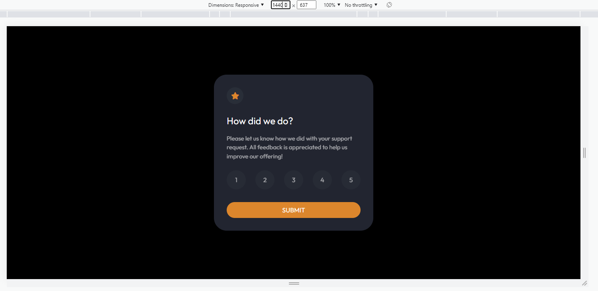
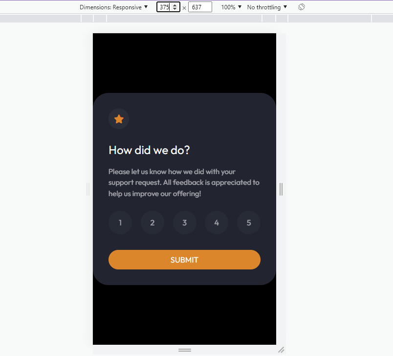
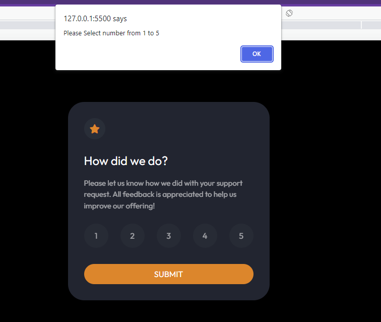
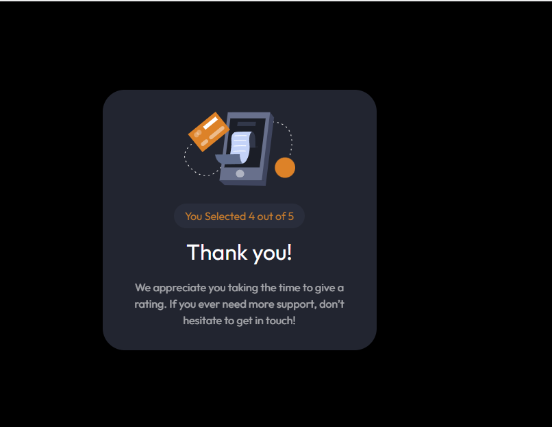

# Frontend Mentor - Interactive rating component solution

This is a solution to the [Interactive rating component challenge on Frontend Mentor](https://www.frontendmentor.io/challenges/interactive-rating-component-koxpeBUmI). Frontend Mentor challenges help you improve your coding skills by building realistic projects.

## Table of contents

- [Overview](#overview)
  - [The challenge](#the-challenge)
  - [Screenshot](#screenshot)
  - [Links](#links)
- [My process](#my-process)
  - [Built with](#built-with)
  - [What I learned](#what-i-learned)
- [Author](#author)

**Note: Delete this note and update the table of contents based on what sections you keep.**

## Overview

This my Second FrontEndMentor Project which is about building Interactive-Rating-Component

### The challenge

Users should be able to:

- View the optimal layout for the app depending on their device's screen size
- See hover states for all interactive elements on the page
- Select and submit a number rating
- See the "Thank you" card state after submitting a rating

### Screenshot

### Links

- Solution URL: [GitHub](https://github.com/Wali1209/interactive-rating-component-main)
- Live Site URL: [GH-Pages](https://wali1209.github.io/interactive-rating-component-main/)

## My process

- Edit the given challenge in VSCode
- Building HTML Structure
- Applying styling to the structure
- Pushing local Repository of Git to Remote
- Deploying Project to GH-Pages

### Built with

- Semantic HTML5 markup
- CSS custom properties
- Flexbox

### What I learned

Basic of StackBlitz

## Author

- Frontend Mentor - [@Wali1209](https://www.frontendmentor.io/profile/Wali1209)
- GitHUB - [@Wali1209](https://github.com/Wali1209)
- Facebook - [Wali Hashmi](https://www.facebook.com/mdwali.hashmi.1/)
- Twitter - [@MWali1209](https://twitter.com/MWali1209)
